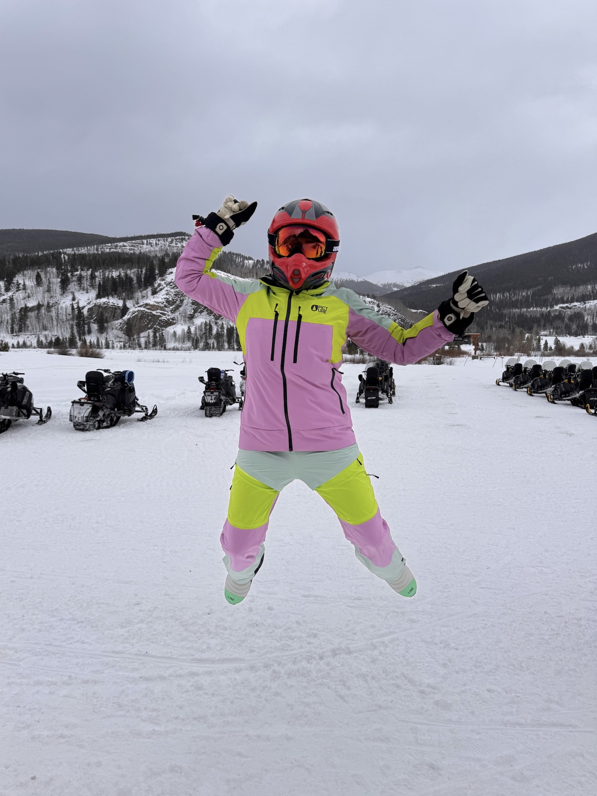

# Lily Stone
## CPE 322: Engineering Design VI
[Group Site](https://sites.google.com/stevens.edu/thebestdesign6group/home)

[Labs](https://github.com/Lilyaddy15/design6_spring2025/tree/main/Labs)
### About Me
**Student at Stevens Institute of Technology**
>Computer Engineering Undergraduate
- From Los Angeles, California
- Attends School in Hoboken, New Jersey

_Involvements on Campus_
1. iSTEM@Stevens Program
2. Undergraduate Student Ambassador
3. Sigma Delta Tau Sorority
4. Gear and Triangle
5. Order of Omega
6. IEEE Eta Kappa Nu
7. Tau Beta Pi

---
### Code
- C++
- Python
- JavaScript
- React Native
- etc.

`cout<<"Welcome to my GitHub Repo for CPE 322" << endl;`

---

[iSTEM Program Update](https://www.stevens.edu/news/stevens-institute-of-technology-receives-usd10-million-gift-to-expand)

[Check out my feature in the Stevens Indicator Magazine!](https://www.stevens.edu/indicator/fall-2024/seen-and-heard)

---
### Fun Things
Over winter break I was in Avon, Colorado. I went skiing, snowmobiling, and snow tubing.

